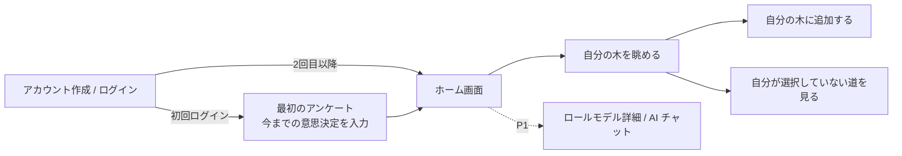
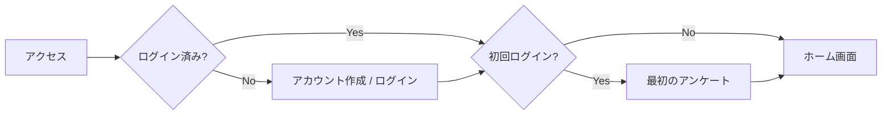
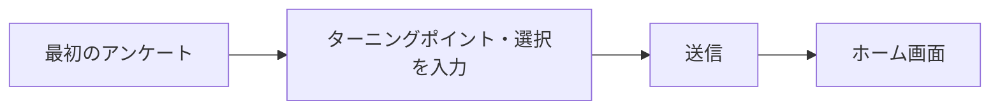
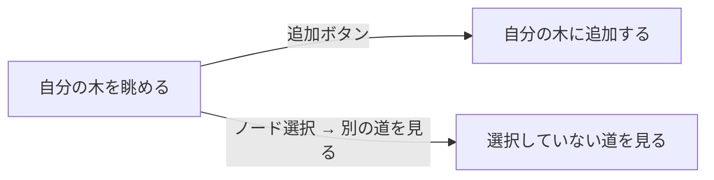
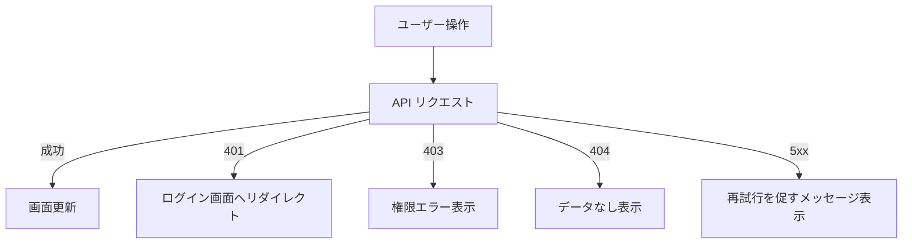
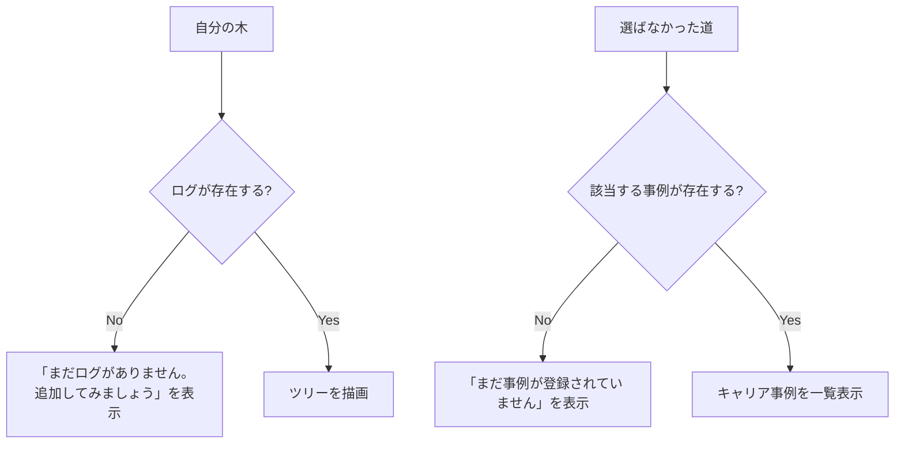

# 画面遷移設計：Decision Path

---

## 0. 設計前提

| 項目 | 内容 |
| --- | --- |
| 対象ユーザー | 一般ユーザー（学生・社会人） |
| 対象チャネル | Web アプリのみ |
| デバイス | ブラウザが利用可能な端末 |
| 認証要否 | 全画面認証制（未ログインは `/auth/login` へリダイレクト） |
| 権限制御 | MVP は `USER` ロールのみ |
| MVP 範囲 | P0 画面（アカウント作成〜自分の木の閲覧・追加・分岐確認） |

---

## 1. 画面一覧

| ID | 画面名 | 役割 | 認証 | 優先度 |
| --- | --- | --- | --- | --- |
| S-01 | アカウント作成 / ログイン | 新規登録・ログイン | 不要 | P0 |
| S-02 | 最初のアンケート | 初回のみ表示。これまでの意思決定ログを一括入力する | 必須 | P0 |
| S-03 | ホーム画面・自分の木（ツリー表示） | 自分の意思決定ログをツリーで可視化する | 必須 | P0 |
| S-04 | 意思決定追加 | 新しいターニングポイント・選択を木に追加する | 必須 | P0 |
| S-05 | 選ばなかった道 | 別の選択肢を取った場合のキャリア事例を表示する | 必須 | P0 |
| S-06 | ロールモデル詳細 | ロールモデルのキャリア履歴表示 / AI チャット | 必須 | P1 |

---

## 2. 全体遷移図

---

## 3. 認証フロー

---

## 4. 画面別詳細

### S-01：アカウント作成 / ログイン

| 項目 | 内容 |
| --- | --- |
| URL | `/auth/login` |
| 主要操作 | メールアドレス + パスワードで登録 / ログイン |
| 遷移先 | 初回 → S-02 / 2 回目以降 → S-03 |

---

### S-02：最初のアンケート

| 項目 | 内容 |
| --- | --- |
| URL | `/onboarding` |
| 主要操作 | ターニングポイントと選択を複数入力して送信 |
| 遷移先 | S-03（ホーム画面） |
| 備考 | 初回ログイン時のみ表示。完了後は `users.onboarded = true` にする |

---

### S-03：ホーム画面

| 項目 | 内容 |
| --- | --- |
| URL | `/` |
| 主要操作 | 「自分の木を見る」ボタン / ロールモデルを探す（P1） |
| 遷移先 | S-04（自分の木） / S-07（ロールモデル詳細・P1） |

---

### S-04：自分の木（ツリー表示）

| 項目 | 内容 |
| --- | --- |
| URL | `/tree` |
| 主要操作 | ツリーを閲覧 / ノードを選択して分岐を確認 / 追加ボタンで S-05 へ |
| 遷移先 | S-05（追加） / S-06（選ばなかった道） |

---

### S-05：意思決定追加

| 項目 | 内容 |
| --- | --- |
| URL | `/tree/add` |
| 主要操作 | ターニングポイント・選択肢・選んだ選択を入力して保存 |
| 遷移先 | 保存後 → S-04（自分の木に戻る） |

---

### S-06：選ばなかった道

| 項目 | 内容 |
| --- | --- |
| URL | `/tree/branches?turning_point=xxx&choice=yyy` |
| 主要操作 | 別の選択をした人のキャリア事例を一覧で確認する |
| 遷移先 | S-04（自分の木に戻る） / S-07（ロールモデル詳細・P1） |

---

### S-07：ロールモデル詳細 / AI チャット（P1）

| 項目 | 内容 |
| --- | --- |
| URL | `/role-models/:id` |
| 主要操作 | キャリア履歴の閲覧 / AI チャットで質問する |
| 遷移先 | S-03（ホーム画面） |

---

## 5. エラーフロー

---

## 6. 空状態 / 初回体験

---

## 7. URL 設計

| 画面 ID | 画面名 | URL |
| --- | --- | --- |
| S-01 | アカウント作成 / ログイン | `/login` |
| S-02 | 最初のアンケート | `/onboarding` |
| S-03 | ホーム画面 | `/` |
| S-04 | 自分の木 | `/tree` |
| S-05 | 意思決定追加 | `/tree/add` |
| S-06 | 選ばなかった道 | `/tree/branches` |
| S-07 | ロールモデル詳細 | `/role-models/:id` |
