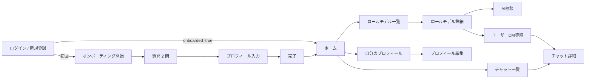

# 画面遷移設計：Decision Path

---

## 0. 設計前提

| 項目 | 内容 |
| --- | --- |
| 対象ユーザー | 学生・社会人の一般ユーザー |
| 対象チャネル | Web アプリ |
| デバイス | PC / スマートフォンのブラウザ |
| 認証要否 | 認証後利用が前提。未ログイン時は `/auth/login` へ誘導 |
| ナビゲーション | 下部タブバーで `ホーム / チャット / ロールモデル / プロフィール` を移動 |
| MVP 範囲 | オンボーディング、ホームの木、未来候補、ロールモデル比較、AI相談、DM、プロフィール編集 |

---

## 1. 画面一覧

| ID | 画面名 | URL | 役割 |
| --- | --- | --- | --- |
| S-01 | ログイン | `/auth/login` | 認証入口 |
| S-02 | 新規登録 | `/auth/sign-up` | 新規アカウント作成 |
| S-03 | オンボーディング開始 | `/onboarding` | 3 ステップの導入 |
| S-04 | オンボーディング質問 | `/onboarding/form` | 必須 2 問の入力 |
| S-05 | オンボーディングプロフィール | `/onboarding/profile` | 名前必須のプロフィール入力 |
| S-06 | オンボーディング完了 | `/onboarding/done` | 完了案内 |
| S-07 | ホーム | `/` | 自分の木、未来候補、主ロールモデル比較 |
| S-08 | ロールモデル一覧 | `/rolemodel` | 他ユーザーの検索・一覧表示 |
| S-09 | ロールモデル詳細 | `/profile/[uid]` | 他ユーザーのプロフィール、ツリー、タイムライン |
| S-10 | AI相談 | `/chat/model/[uid]` | ロールモデル擬似人格との対話 |
| S-11 | 実ユーザーDM導線 | `/chat/user/[uid]` | 1対1 room を作成または再利用して遷移 |
| S-12 | チャット一覧 | `/chat` | room 一覧表示 |
| S-13 | チャット詳細 | `/chat/[roomId]` | room 単位の会話 |
| S-14 | 自分のプロフィール閲覧 | `/profile` | 自分の登録内容確認・ログアウト |
| S-15 | 自分のプロフィール編集 | `/profile/edit` | 名前、アイコン、職業、年齢、居住地の編集 |
| S-16 | 設定 | `/settings` | 最低限の設定導線 |

---

## 2. 全体遷移図



---

## 3. 認証フロー

```mermaid
flowchart LR
    Access[アクセス] --> AuthCheck{ログイン済み?}
    AuthCheck -->|No| Login[/auth/login]
    AuthCheck -->|Yes| OnboardCheck{profiles.onboarded?}
    OnboardCheck -->|No| Onboarding[/onboarding]
    OnboardCheck -->|Yes| Home[/]
```

---

## 4. 画面別詳細

### S-03: オンボーディング開始

| 項目 | 内容 |
| --- | --- |
| URL | `/onboarding` |
| 主要操作 | 導入文確認、質問ステップへ進む |
| 遷移先 | `/onboarding/form` |

### S-04: オンボーディング質問

| 項目 | 内容 |
| --- | --- |
| URL | `/onboarding/form` |
| 主要操作 | `present` と `reason` の 2 問に回答 |
| 入力要件 | 2 項目とも必須 |
| 遷移先 | `/onboarding/profile` |

### S-05: オンボーディングプロフィール

| 項目 | 内容 |
| --- | --- |
| URL | `/onboarding/profile` |
| 主要操作 | 名前、アイコン、職業、年齢、居住地の入力 |
| 入力要件 | `displayName` は必須、他は任意 |
| 備考 | 直前の質問回答は sessionStorage の draft として引き継ぐ |
| 遷移先 | 保存後 `/onboarding/done` |

### S-07: ホーム

| 項目 | 内容 |
| --- | --- |
| URL | `/` |
| 主要操作 | 木の閲覧、ノード追加、未来候補表示、主ロールモデル比較、ホーム上のAI助言 |
| 備考 | スマホではロールモデル比較カードを compact 表示できる |

ホームでできること:

- ノード上部ホバーで未来ノード追加
- ノード下部ホバーで過去ノード追加
- ノード本体クリックで未来候補を最大 5 本、最大 3 手先まで表示
- 主ロールモデルが選択済みなら、その場で比較 AI アドバイスを取得

### S-08: ロールモデル一覧

| 項目 | 内容 |
| --- | --- |
| URL | `/rolemodel` |
| 主要操作 | 他ユーザーの検索、保存状態確認、詳細遷移 |
| データ源 | `profiles` + `nodes` の実データ |

### S-09: ロールモデル詳細

| 項目 | 内容 |
| --- | --- |
| URL | `/profile/[uid]` |
| 主要操作 | タイムライン閲覧、ツリー閲覧、ロールモデル保存、比較AI、AI相談、DM |
| 備考 | 自分自身の `uid` の場合は `/profile` へ戻す |

### S-10: AI相談

| 項目 | 内容 |
| --- | --- |
| URL | `/chat/model/[uid]` |
| 主要操作 | ロールモデル擬似人格との対話 |
| 備考 | room ベースではなく、その場で AI 応答を返す専用画面 |

### S-11/S-13: 実ユーザーDM

| 項目 | 内容 |
| --- | --- |
| URL | `/chat/user/[uid]` → `/chat/[roomId]` |
| 主要操作 | 1対1 DM room を再利用または作成して会話 |
| 備考 | メッセージ本文は Supabase に保存、Realtime で同期 |

### S-14/S-15: 自分のプロフィール

| 項目 | 内容 |
| --- | --- |
| URL | `/profile` / `/profile/edit` |
| 主要操作 | 閲覧、編集、ログアウト |
| 備考 | 一覧画面と編集画面を分離済み |

---

## 5. 空状態とモバイル方針

- ホームでノードが 1 件だけでも未来 / 過去追加は可能
- 未来候補に一致が無い場合は、オーバーレイを出さずエラーも出さない
- スマホでは未来候補の補助パネルは表示せず、ピンクの予測ノードだけ出す
- スマホではホームのロールモデルカードを compact 表示にできる

---

## 6. URL 設計

| 画面 | URL |
| --- | --- |
| ログイン | `/auth/login` |
| 新規登録 | `/auth/sign-up` |
| オンボーディング開始 | `/onboarding` |
| オンボーディング質問 | `/onboarding/form` |
| オンボーディングプロフィール | `/onboarding/profile` |
| オンボーディング完了 | `/onboarding/done` |
| ホーム | `/` |
| ロールモデル一覧 | `/rolemodel` |
| ロールモデル詳細 | `/profile/[uid]` |
| AI相談 | `/chat/model/[uid]` |
| 実ユーザーDM導線 | `/chat/user/[uid]` |
| チャット一覧 | `/chat` |
| チャット詳細 | `/chat/[roomId]` |
| 自分のプロフィール閲覧 | `/profile` |
| 自分のプロフィール編集 | `/profile/edit` |
| 設定 | `/settings` |
