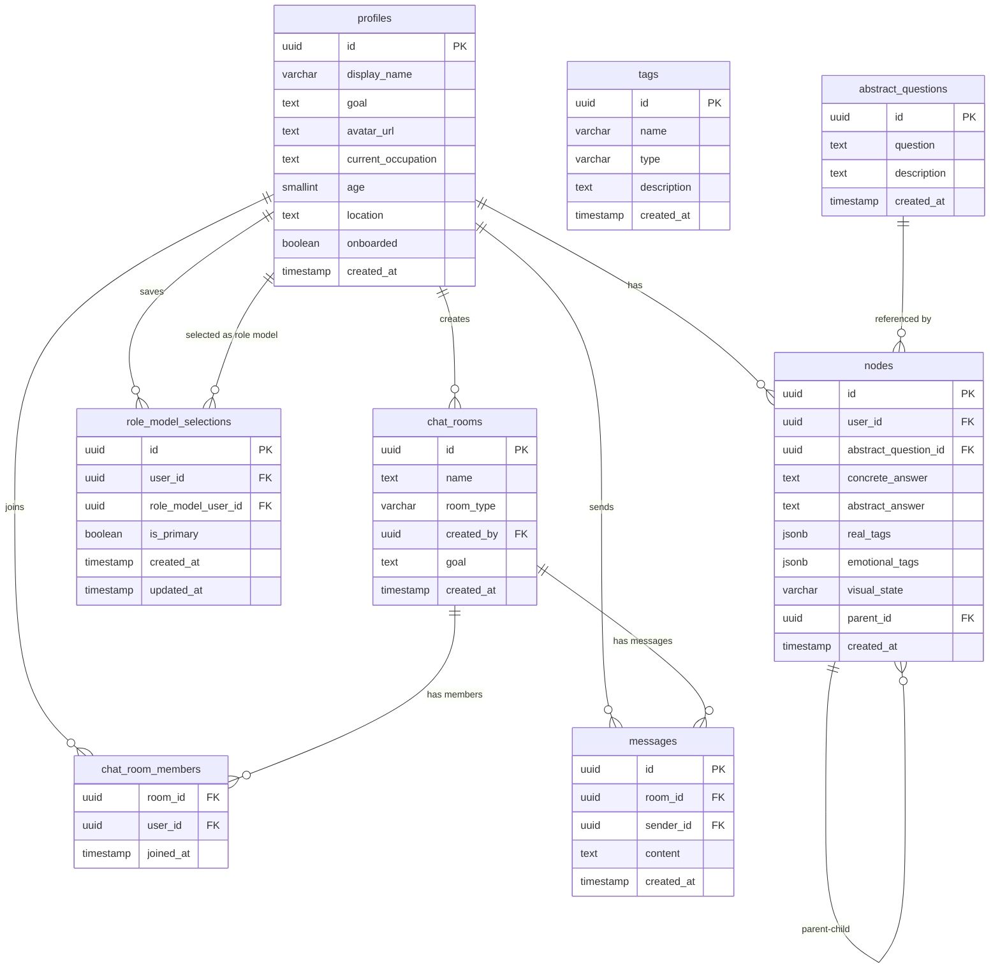

# DB 設計：Decision Path

---

## 0. 設計前提

| 項目 | 内容 |
| --- | --- |
| DB | Supabase PostgreSQL |
| ORM | Prisma |
| 認証 | Supabase Auth (`auth.users`) |
| ID 戦略 | UUID |
| 論理削除 | なし |

---

## 1. テーブル一覧

| テーブル | 役割 |
| --- | --- |
| `profiles` | アプリ固有のプロフィール情報 |
| `tags` | AI タグ付けで使うタグマスタ |
| `abstract_questions` | 抽象質問マスタ |
| `nodes` | ユーザーの意思決定ログ |
| `role_model_selections` | 保存したロールモデル |
| `chat_rooms` | chat room 本体 |
| `chat_room_members` | room と user の所属関係 |
| `messages` | メッセージ本文 |

---

## 2. ERD

---

## 3. カラム定義

### `profiles`

| カラム | 型 | 制約 | 説明 |
| --- | --- | --- | --- |
| `id` | UUID | PK / FK → `auth.users.id` | 認証ユーザー ID |
| `display_name` | VARCHAR(50) | NULLABLE | 表示名。アプリ上は必須入力 |
| `goal` | TEXT | NULLABLE | 将来的な goal / community 判定用 |
| `avatar_url` | TEXT | NULLABLE | プロフィール画像 URL |
| `current_occupation` | TEXT | NULLABLE | 現在の活動 / 職業 |
| `age` | SMALLINT | NULLABLE | 年齢 |
| `location` | TEXT | NULLABLE | 居住地 |
| `onboarded` | BOOLEAN | NOT NULL DEFAULT false | 初回導線完了フラグ |
| `created_at` | TIMESTAMP | NOT NULL DEFAULT now() | 作成日時 |

補足:

- `display_name`, `avatar_url`, `current_occupation`, `location` は空文字禁止
- `age` は `0..150`

### `tags`

| カラム | 型 | 制約 | 説明 |
| --- | --- | --- | --- |
| `id` | UUID | PK | タグ ID |
| `name` | VARCHAR(100) | UNIQUE | タグ名 |
| `type` | VARCHAR(20) | NOT NULL | `real` または `emotional` |
| `description` | TEXT | NULLABLE | 補足説明 |
| `created_at` | TIMESTAMP | NOT NULL DEFAULT now() | 作成日時 |

### `abstract_questions`

| カラム | 型 | 制約 | 説明 |
| --- | --- | --- | --- |
| `id` | UUID | PK | 質問 ID |
| `question` | TEXT | NOT NULL | 抽象質問 |
| `description` | TEXT | NULLABLE | 補足説明 |
| `created_at` | TIMESTAMP | NOT NULL DEFAULT now() | 作成日時 |

### `nodes`

| カラム | 型 | 制約 | 説明 |
| --- | --- | --- | --- |
| `id` | UUID | PK | ノード ID |
| `user_id` | UUID | FK → `profiles.id` | 所有者 |
| `abstract_question_id` | UUID | FK → `abstract_questions.id`, NULLABLE | 付属する抽象質問 |
| `concrete_answer` | TEXT | NOT NULL | 今何をしているか / 何を選んだか |
| `abstract_answer` | TEXT | NULLABLE | なぜそうしたか |
| `real_tags` | JSONB | NOT NULL DEFAULT `[]` | 事実タグ ID 配列 |
| `emotional_tags` | JSONB | NOT NULL DEFAULT `[]` | 感情タグ ID 配列 |
| `visual_state` | VARCHAR(50) | NULLABLE | 可視化用状態 |
| `parent_id` | UUID | FK → `nodes.id`, NULLABLE | 親ノード。NULL はルート |
| `created_at` | TIMESTAMP | NOT NULL DEFAULT now() | 作成日時 |

補足:

- 木構造は隣接リスト方式
- 未来候補検索では `real_tags` / `emotional_tags` の重なりを使う

### `role_model_selections`

| カラム | 型 | 制約 | 説明 |
| --- | --- | --- | --- |
| `id` | UUID | PK | 行 ID |
| `user_id` | UUID | FK → `profiles.id` | 保存した側 |
| `role_model_user_id` | UUID | FK → `profiles.id` | 保存された側 |
| `is_primary` | BOOLEAN | NOT NULL DEFAULT false | 主ロールモデルか |
| `created_at` | TIMESTAMP | NOT NULL DEFAULT now() | 保存日時 |
| `updated_at` | TIMESTAMP | NOT NULL | 更新日時 |

制約:

- `UNIQUE (user_id, role_model_user_id)`
- `CHECK (user_id <> role_model_user_id)`
- `WHERE is_primary = true` の部分ユニークで主ロールモデルは 1 件まで

### `chat_rooms`

| カラム | 型 | 制約 | 説明 |
| --- | --- | --- | --- |
| `id` | UUID | PK | room ID |
| `name` | TEXT | NOT NULL | room 名 |
| `room_type` | VARCHAR(20) | NOT NULL | 現行は `dm_model` / `community` |
| `created_by` | UUID | FK → `profiles.id` | 作成者 |
| `goal` | TEXT | NULLABLE | community 用の goal |
| `created_at` | TIMESTAMP | NOT NULL DEFAULT now() | 作成日時 |

補足:

- 実ユーザー DM も現行では `dm_model` を流用している

### `chat_room_members`

| カラム | 型 | 制約 | 説明 |
| --- | --- | --- | --- |
| `room_id` | UUID | PK(FK) → `chat_rooms.id` | room ID |
| `user_id` | UUID | PK(FK) → `profiles.id` | user ID |
| `joined_at` | TIMESTAMP | NOT NULL DEFAULT now() | 参加日時 |

### `messages`

| カラム | 型 | 制約 | 説明 |
| --- | --- | --- | --- |
| `id` | UUID | PK | message ID |
| `room_id` | UUID | FK → `chat_rooms.id` | 所属 room |
| `sender_id` | UUID | FK → `profiles.id` | 送信者 |
| `content` | TEXT | NOT NULL | 本文 |
| `created_at` | TIMESTAMP | NOT NULL DEFAULT now() | 送信日時 |

---

## 4. 検索と利用メモ

- ホームの未来候補は `nodes.real_tags` と `nodes.emotional_tags` の重なりを使う
- ロールモデル一覧は `profiles` と `nodes` の最新分岐を合成して組み立てる
- 主ロールモデル表示は `role_model_selections.is_primary = true` を見る
- チャット一覧は `chat_room_members` と `messages` の最新 1 件を結合して作る

---

## 5. 現在の設計上の注意

- `concrete_questions` テーブルは現行 schema には存在しない
- AI相談の会話履歴は DB に保存していない
- 人間 DM と mentor room の `room_type` 分離は今後の改善候補
