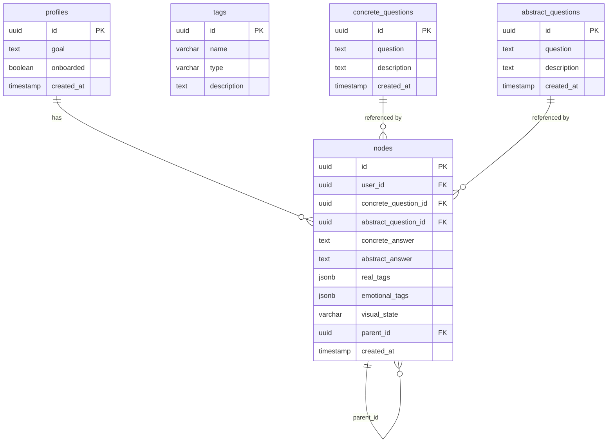

# DB 設計：Decision Path

---

## 0. 設計前提

| 項目 | 内容 |
| --- | --- |
| DB | Supabase（PostgreSQL） |
| ORM | Prisma |
| ID 戦略 | UUID（全テーブル共通） |
| 認証 | Supabase Auth（`auth.users` を参照） |
| アクセス制御 | Supabase RLS |
| 論理削除 | なし（MVP） |

---

## 1. テーブル一覧

| テーブル | 役割 | Phase |
| --- | --- | --- |
| `profiles` | ユーザーのアプリ固有情報（`auth.users` の拡張） | P0 |
| `tags` | タグマスタ（realTag・emotionalTag 共通） | P0 |
| `abstract_questions` | 抽象質問マスタ（意思決定の背景・軸を問う質問） | P0 |
| `concrete_questions` | 具体質問マスタ（実際の選択を問う質問） | P0 |
| `nodes` | ユーザーの意思決定ログ（木の1ノード） | P0 |

---

## 2. ERD



---

## 3. カラム定義

### `profiles`

`auth.users` が持つ名前・メール・アバターは持たない。アプリ固有情報のみ。

| カラム | 型 | 制約 | 説明 |
| --- | --- | --- | --- |
| `id` | UUID | PK / FK → `auth.users.id` | Supabase Auth のユーザー ID と同値 |
| `goal` | TEXT | | ユーザーが設定した最終目標 |
| `onboarded` | BOOLEAN | NOT NULL DEFAULT false | 初回アンケート完了フラグ |
| `created_at` | TIMESTAMP | NOT NULL | |

---

### `tags`

realTag・emotionalTag で共通利用するタグマスタ。運営がシードで投入。

| カラム | 型 | 制約 | 説明 |
| --- | --- | --- | --- |
| `id` | UUID | PK | |
| `name` | VARCHAR | NOT NULL UNIQUE | タグ名（例：「大学進学」「安定」「挑戦」） |
| `type` | VARCHAR | NOT NULL | `real`（事実ベース）/ `emotional`（感情・価値観ベース） |
| `description` | TEXT | | タグの説明 |
| `created_at` | TIMESTAMP | NOT NULL | |

INDEX: `type`, `name`

---

### `abstract_questions`

意思決定の背景・軸を問う抽象的な質問のマスタ。運営がシードで投入。

| カラム | 型 | 制約 | 説明 |
| --- | --- | --- | --- |
| `id` | UUID | PK | |
| `question` | TEXT | NOT NULL | 質問文（例：「その選択で何を大切にしましたか？」） |
| `description` | TEXT | | 質問の補足説明 |
| `created_at` | TIMESTAMP | NOT NULL | |

---

### `concrete_questions`

実際の選択を問う具体的な質問のマスタ。運営がシードで投入。

| カラム | 型 | 制約 | 説明 |
| --- | --- | --- | --- |
| `id` | UUID | PK | |
| `question` | TEXT | NOT NULL | 質問文（例：「大学卒業後、どのような進路を選びましたか？」） |
| `description` | TEXT | | 質問の補足説明 |
| `created_at` | TIMESTAMP | NOT NULL | |

---

### `nodes`

ユーザーの意思決定ログ。1レコード = 木の1ノード。

| カラム | 型 | 制約 | 説明 |
| --- | --- | --- | --- |
| `id` | UUID | PK | |
| `user_id` | UUID | FK → `auth.users.id` NOT NULL | ノードの所有者。RLS でアクセス制御 |
| `concrete_question_id` | UUID | FK → `concrete_questions.id` NOT NULL | このノードで答えた具体質問 |
| `abstract_question_id` | UUID | FK → `abstract_questions.id` NULLABLE | このノードに付属する抽象質問（任意） |
| `concrete_answer` | TEXT | NOT NULL | 具体質問へのユーザーの回答（例：「大企業に就職した」） |
| `abstract_answer` | TEXT | | 抽象質問へのユーザーの回答（例：「安定を求めていた」） |
| `real_tags` | JSONB | NOT NULL DEFAULT '[]' | 事実ベースのタグ ID 配列（例：`["uuid-1", "uuid-2"]`） |
| `emotional_tags` | JSONB | NOT NULL DEFAULT '[]' | 感情・価値観ベースのタグ ID 配列 |
| `visual_state` | VARCHAR | | 3D 可視化用の状態値（色・感情等を文字列で保持） |
| `parent_id` | UUID | FK → `nodes.id` NULLABLE | 親ノードの ID。NULL = 木のルート |
| `created_at` | TIMESTAMP | NOT NULL | |

INDEX: `user_id`, `parent_id`, `real_tags`（GIN）, `emotional_tags`（GIN）

---

## 4. タグ検索のクエリイメージ

### emotionalTag が部分一致する他ユーザーのノードを取得

```sql
-- 自分の emotional_tags と1つ以上一致する他人のノードを取得
SELECT n.*
FROM nodes n
WHERE n.emotional_tags ?| array['uuid-tag-1', 'uuid-tag-2']
  AND n.user_id != :my_user_id
ORDER BY n.created_at DESC
```

GIN インデックスにより高速に検索できる。

---

## 5. RLS ポリシー方針

| テーブル | 読み取り | 書き込み |
| --- | --- | --- |
| `profiles` | 本人のみ | 本人のみ |
| `nodes` | 本人のみ | 本人のみ |
| `tags` | 全員 | 不可（運営のみ直接 DB） |
| `abstract_questions` | 全員 | 不可 |
| `concrete_questions` | 全員 | 不可 |
