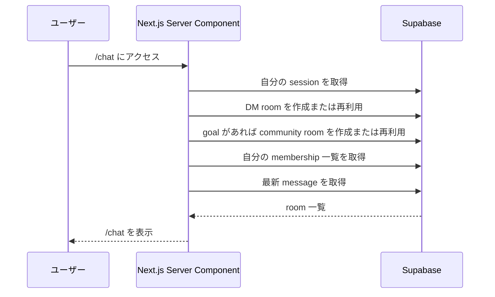
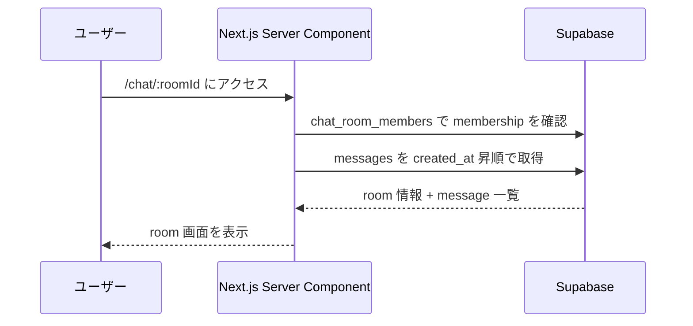
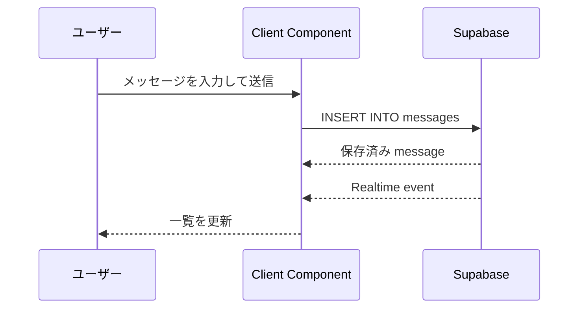

# チャット仕様書：Decision Path

---

## 0. 目的

Decision Path におけるチャット機能の MVP 仕様を定義する。

本仕様は以下の 2 種類の会話を、**room ベースの共通構造**で扱うことを前提とする。

1. ロールモデルとの 1 対 1 チャット
2. 同じ goal を持つユーザー同士のコミュニティチャット

---

## 1. 設計前提

| 項目      | 内容                  |
| ------- | ------------------- |
| フロントエンド | Next.js App Router  |
| 認証      | Supabase Auth       |
| DB      | Supabase PostgreSQL |
| ORM     | Prisma              |
| チャット送受信 | Supabase JS         |
| リアルタイム  | Supabase Realtime   |
| 実装優先度   | MVP / 最短実装          |
|         |                     |

> 注意: 現在のチャット機能は **DB レイヤーでの厳密な access control をまだ持たない**。  
> そのため、本仕様は「MVP の動作仕様」であり、本番運用レベルの認可仕様ではない。

---

## 2. スコープ

### 対象

- `/chat` で自分の所属 room 一覧を表示する
- `/chat/[roomId]` でメッセージ履歴を表示する
- room にメッセージを送信できる
- 別タブで新規メッセージがリアルタイム反映される
- DM と community を同じテーブル構造で扱う

### 対象外

- 既読
- 添付ファイル
- 返信
- スタンプ / リアクション
- 通知
- 管理画面
- 通報 / モデレーション
- 本番レベルの認可強化

---

## 3. 画面仕様

### 3-1. チャット一覧

| 項目   | 内容                                       |
| ---- | ---------------------------------------- |
| URL  | `/chat`                                  |
| 役割   | 自分が所属する room の一覧表示                       |
| 表示項目 | room 名 / room 種別 / goal / 最新メッセージ / 更新時刻 |
| 主な操作 | room を選択して詳細へ遷移                          |

#### room 自動生成ルール

`/chat` 初回表示時に、ログインユーザーに対して以下を自動補完する。

1. `dm_model` room を 1 つ作成または再利用する
2. `profiles.goal` が設定されていれば、その goal の `community` room を 1 つ作成または再利用する
3. 作成済み room には `chat_room_members` を通して自動参加させる

---

### 3-2. room 詳細

| 項目   | 内容                               |
| ---- | -------------------------------- |
| URL  | `/chat/[roomId]`                 |
| 役割   | メッセージ履歴の閲覧と送信                    |
| 表示項目 | room 名 / goal / メッセージ一覧 / 入力フォーム |
| 主な操作 | メッセージ送信                          |

#### 表示制御

- サーバー側で `chat_room_members` を参照し、対象ユーザーが room に所属している場合のみ表示する
- 所属していない room は `notFound` 扱いにする

---

## 4. データモデル

チャットは以下 3 テーブルで構成する。

### 4-1. `chat_rooms`

room 本体を表す。

| カラム          | 型           | 説明                       |
| ------------ | ----------- | ------------------------ |
| `id`         | UUID        | room ID                  |
| `name`       | TEXT        | room 名                   |
| `room_type`  | VARCHAR(20) | `dm_model` / `community` |
| `created_by` | UUID        | room 作成者                 |
| `goal`       | TEXT NULL   | 関連する goal                |
| `created_at` | TIMESTAMP   | 作成日時                     |

### 4-2. `chat_room_members`

room と user の所属関係を表す。

| カラム         | 型         | 説明      |
| ----------- | --------- | ------- |
| `room_id`   | UUID      | room ID |
| `user_id`   | UUID      | user ID |
| `joined_at` | TIMESTAMP | 参加日時    |

主キーは `(room_id, user_id)` の複合キーとする。

### 4-3. `messages`

メッセージ本体を表す。

| カラム          | 型         | 説明          |
| ------------ | --------- | ----------- |
| `id`         | UUID      | message ID  |
| `room_id`    | UUID      | 所属 room     |
| `sender_id`  | UUID      | 送信者 user ID |
| `content`    | TEXT      | 本文          |
| `created_at` | TIMESTAMP | 送信日時        |

---

## 5. room 種別

| `room_type` | 用途                  | 備考                          |
| ----------- | ------------------- | --------------------------- |
| `dm_model`  | ロールモデルとの 1 対 1 チャット | 初期段階では AI 応答未接続でもよい         |
| `community` | 同じ goal を持つユーザーの会話  | room 名は `goal + コミュニティ` とする |

---

## 6. 取得・送信フロー

### 6-1. 一覧表示

### 6-2. room 詳細表示

### 6-3. メッセージ送信

---

## 7. Realtime 仕様

Realtime は `messages` テーブルを対象に `postgres_changes` を購読する。

### 購読条件

- schema: `public`
- table: `messages`
- filter: `room_id=eq.{roomId}`
- event: `INSERT`

### UI 反映方針

- 新着 message をローカル state にマージする
- 同一 `id` が既に存在する場合は重複追加しない
- 新着受信時は最下部までスクロールする

---

## 8. アクセス制御

### 現在の方針

現在は **RLS 未使用** とし、以下のアプリ側制御のみを実施する。

- `/chat` 一覧は `chat_room_members.user_id = currentUserId` で絞る
- `/chat/[roomId]` は `chat_room_members` に所属がある場合だけ表示する

### 制約

この方式では、Supabase クライアントを直接叩いた場合の DB レベル保護はない。

したがって、現時点では以下を満たさない。

- room member 以外の DB 読み取り防止
- room member 以外の message insert 防止
- `sender_id = auth.uid()` の DB レベル保証

### 将来の強化方針

本番運用前には以下のいずれかへ移行する。

1. RLS を導入して DB レベルで認可する
2. メッセージ送信を server action / Route Handler 経由にし、サーバー側で membership を検証する

---

## 9. エラー / 空状態

| ケース           | 表示方針                 |
| ------------- | -------------------- |
| room が 0 件    | 「チャットルームはまだありません」を表示 |
| message が 0 件 | 「まだメッセージはありません」を表示   |
| room 非所属      | 404 相当の画面に遷移         |
| insert 失敗     | エラーメッセージをフォーム下に表示    |
| Realtime 未接続  | 送信は可能。自動更新のみ失敗       |

---

## 10. MVP 実装方針

| 項目        | 方針                                         |
| --------- | ------------------------------------------ |
| DB スキーマ管理 | Prisma migration                           |
| 画面実装      | Next.js App Router                         |
| データ取得     | Server Component + Supabase server client  |
| 送信        | Client Component + Supabase browser client |
| リアルタイム受信  | Supabase Realtime                          |
| room 自動作成 | サーバー側 helper で実施                           |

---

## 11. 将来拡張

将来的には以下を追加可能とする。

- AI ロールモデル応答の自動生成
- community room への自動参加条件の細分化
- unread count
- message 既読管理
- 添付ファイル
- moderation
- 通知
- server-side message validation
- RLS 導入

---

## 12. 実装メモ

- `profiles.id` は `auth.users.id` と同値である
- room 一覧は `chat_room_members` を起点に取得する
- `messages` は `room_id, created_at` の複合 index を持つ
- `messages` テーブルは Realtime publication に追加する
- DM room は「ユーザーごとに 1 room」を基本とする
- community room は「goal ごとに 1 room」を基本とする

---

