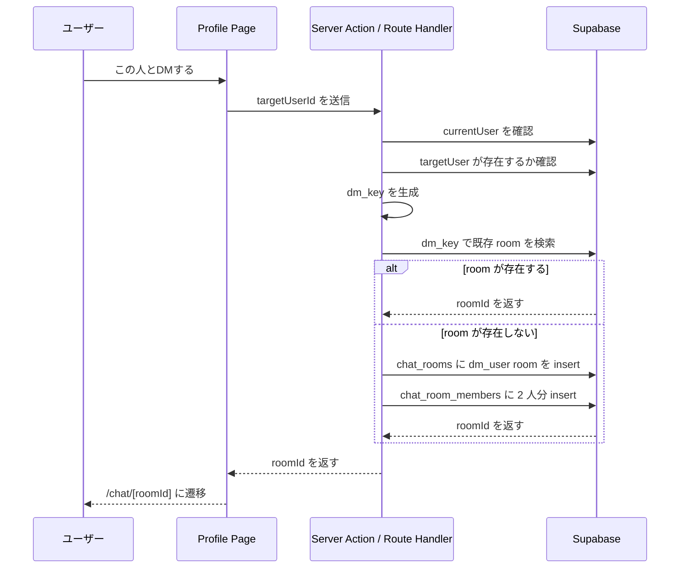

# 実ユーザー DM 実装方針：Decision Path

---

## 0. 目的

ユーザーが他ユーザーのプロフィールを開き、`この人とDMする` ボタンから 1 対 1 の DM room を開始できるようにする。

既存のチャット実装は **room ベース** で統一されているため、実ユーザー DM も同じ構造のまま追加する。

---

## 1. 方針

### 結論

実ユーザー DM のために新しい message テーブルは作らない。  
既存の以下 3 テーブルをそのまま使う。

- `chat_rooms`
- `chat_room_members`
- `messages`

追加するのは主に以下の 2 点だけでよい。

1. `chat_rooms.room_type` に `dm_user` を追加する
2. 同じ 2 人の組み合わせに対して room を一意に再利用できる識別子を持たせる

---

## 2. MVP で実現したい体験

### ユーザーフロー

1. ユーザー A がユーザー B のプロフィールを開く
2. `この人とDMする` ボタンを押す
3. 既に A-B 間の DM room があればその room に遷移する
4. なければ room を新規作成し、A と B を member に追加してから遷移する
5. `/chat/[roomId]` でそのまま会話できる

### UI 最小要件

- プロフィール画面に `この人とDMする` ボタンを表示する
- 自分自身のプロフィールではボタンを表示しない
- `/chat` 一覧に `dm_user` room が表示される
- room 詳細ヘッダーには相手ユーザーの名前を表示する

---

## 3. 推奨データ設計

### 3-1. `chat_rooms` の拡張

`chat_rooms` に以下を追加する。

| カラム      | 型          | 用途                                 |
| ----------- | ----------- | ------------------------------------ |
| `room_type` | VARCHAR(20) | `dm_model` / `community` / `dm_user` |
| `dm_key`    | TEXT NULL   | 実ユーザー DM の一意キー             |

### 3-2. `dm_key` の役割

同じ 2 人の間で room を 1 つに固定するため、`dm_key` を使う。

例:

```text
min(userAId, userBId):max(userAId, userBId)
```

この形式にすると、A→B と B→A が同じキーになる。

### 3-3. なぜ専用テーブルを作らないか

`direct_message_rooms` のような専用テーブルを追加すると、

- room 一覧取得
- member 管理
- message 一覧取得
- Realtime

の処理が room 種別ごとに分かれてしまう。

今回は room ベース統一を優先し、`chat_rooms` の `room_type` と `dm_key` で吸収する。

---

## 4. 必要な schema 変更

### 最小変更

1. `chat_rooms.room_type` の許可値に `dm_user` を追加
2. `chat_rooms.dm_key` を追加
3. `dm_key` 用 index を追加

### 一意制約

理想は `room_type = 'dm_user'` のときだけ `dm_key` を一意にしたい。

PostgreSQL では以下のような partial unique index が適している。

```sql
CREATE UNIQUE INDEX uq_chat_rooms_dm_key
ON chat_rooms (dm_key)
WHERE room_type = 'dm_user';
```

Prisma schema だけでは表現しづらいため、migration SQL で追加するのが現実的。

---

## 5. プロフィール側の前提

実ユーザー DM を自然に見せるには、`profiles` だけでは情報が足りない。

現在の `profiles` には以下がある。

- `id`
- `display_name`
- `avatar_url`
- `current_occupation`
- `age`
- `location`
- `goal`
- `onboarded`
- `created_at`

ただし、過去の既存ユーザーには `display_name` が未設定の可能性がある。  
そのため、最低でも次のいずれかが必要になる。

### 選択肢 A

`profiles` に表示用カラムを追加する。

- `display_name`
- `bio`（任意）

### 選択肢 B

Supabase Auth の `user_metadata` を参照して表示名を出す。

### 推奨

MVP では `profiles.display_name` を追加するのが最も単純。

理由:

- room 一覧に相手名を出しやすい
- プロフィール画面と同じ値を使い回せる
- `auth.users` 直参照よりアプリ都合で管理しやすい

---

## 6. room 作成フロー

実ユーザー DM の room 作成は **Server Action または Route Handler** で行う。

クライアントから直接 `chat_rooms` を叩いて作らせない。

### 理由

- 自分自身との DM 作成を禁止したい
- 相手ユーザーの存在確認をしたい
- 同じ 2 人の room 重複作成を防ぎたい
- `chat_room_members` への 2 件 insert をまとめて扱いたい

### 処理フロー



---

## 7. 推奨 API / Server Action

### 候補

`POST /api/chat/dm`

または

`createOrGetUserDmRoom(targetUserId: string)`

### リクエスト

```json
{
  "targetUserId": "uuid"
}
```

### レスポンス

```json
{
  "roomId": "uuid"
}
```

### バリデーション

- 未認証なら 401
- `targetUserId === currentUserId` なら 400
- 相手ユーザーが存在しなければ 404

---

## 8. `/chat` 一覧側の変更

`dm_user` room は `/chat` 一覧にも混ぜて表示する。

### 表示名の決め方

`dm_user` の場合は room 名を固定文字列にせず、

- `chat_room_members` から相手 user を特定する
- 相手の `display_name` を一覧のタイトルに使う

のが自然。

### 必要な取得情報

- room 本体
- member 一覧
- currentUser 以外の member
- 相手の表示名
- 最新 message

---

## 9. `/chat/[roomId]` 詳細側の変更

`dm_user` room の header は、`room.name` ではなく **相手ユーザー情報**を主表示にする。

### 具体例

- タイトル: `山田 太郎`
- サブタイトル: `1対1のDM`

`dm_model` や `community` は既存の表示ルールのままでよい。

---

## 10. access control 方針

現在の chat は RLS 未導入であるため、実ユーザー DM を追加するなら**message 送信だけはサーバー経由に寄せる**のを推奨する。

### 理由

今の実装では browser client から `messages` に直接 insert しているため、

- 任意の `room_id`
- 任意の `sender_id`

をクライアントから送れてしまう。

人間同士の DM ではこの穴は避けるべき。

### 推奨

`POST /api/chat/messages`

または

`sendMessage(roomId: string, content: string)`

で以下をサーバー側で検証する。

1. currentUser を取得
2. `chat_room_members` に所属があるか確認
3. `messages.sender_id = currentUser.id` で固定
4. insert 実行

Realtime 受信はそのまま Supabase Realtime を使ってよい。

---

## 11. 実装順序

### Step 1

プロフィール表示用データを決める。

推奨:

- `profiles.display_name`

### Step 2

chat schema を拡張する。

- `room_type` に `dm_user`
- `dm_key` 追加
- partial unique index 追加

### Step 3

プロフィール画面を作る。

例:

- `/users/[userId]`

### Step 4

`この人とDMする` の Server Action / API を作る。

### Step 5

`/chat` 一覧と `/chat/[roomId]` を `dm_user` 対応する。

### Step 6

message 送信をサーバー経由へ切り替える。

---

## 12. 非推奨パターン

以下は避ける。

### 1. ユーザーごとに新しい DM テーブルを作る

room ベース統一が崩れるため非推奨。

### 2. `この人とDMする` で毎回新規 room を作る

同じ 2 人の room が増殖する。

### 3. browser client だけで room 作成を完結させる

自分自身との DM 作成や重複作成の制御が弱い。

---

## 13. 最小実装案

一番小さい実装は以下。

1. `profiles.display_name` を追加
2. `chat_rooms.dm_key` を追加
3. `room_type = 'dm_user'` を追加
4. `createOrGetUserDmRoom(targetUserId)` を作る
5. プロフィール画面から room へ遷移する
6. message 送信を server action 化する

これで、**プロフィール起点の人間 DM** を room ベースのまま自然に追加できる。

---
