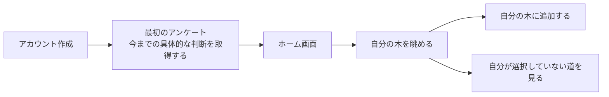
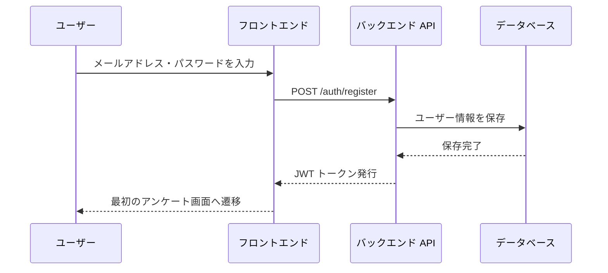
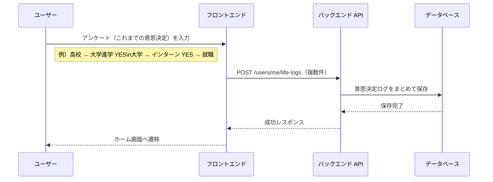
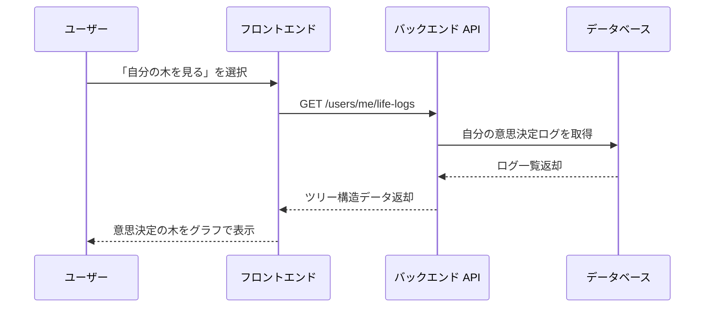
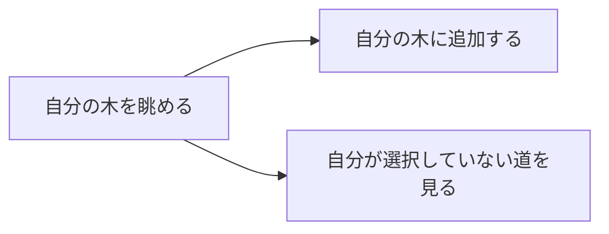
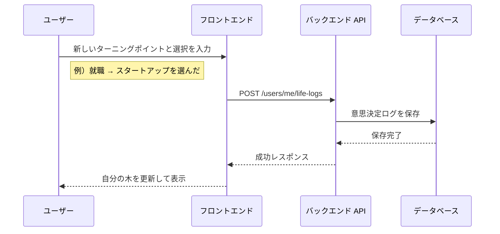
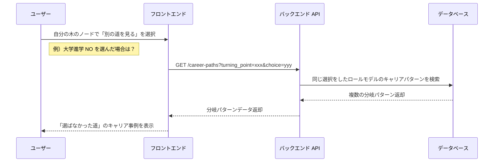

# 処理フロー設計：Decision Path

---

## 0. 設計前提

| 項目 | 内容 |
| --- | --- |
| 対象機能 | アカウント作成 / 最初のアンケート / ホーム画面 / 自分の木を眺める / 自分の木に追加する / 自分が選択していない道を見る |
| 認証方式 | JWT Bearer トークン |
| AI 処理方針 | LLM API 呼び出しはストリーミングで返却 |

---

## 1. 全体フロー概要

---

## 2. アカウント作成フロー

---

## 3. 最初のアンケートフロー

> 今までの具体的な判断（ターニングポイント・選択）を取得する。

---

## 4. ホーム画面

ホーム画面ではユーザーが以下の操作に進める起点となる。

| 操作 | 遷移先 |
| --- | --- |
| 自分の木を見る | 自分の木を眺める画面 |
| ロールモデルを探す | ロールモデル検索（将来拡張） |

---

## 5. 自分の木を眺めるフロー

> ユーザー自身の意思決定ログを木構造（ツリー）で可視化して表示する。

この画面から以下の2つの操作に進める。

---

## 6. 自分の木に追加するフロー

> 新たな意思決定ログを追加し、木を育てる。

---

## 7. 自分が選択していない道を見るフロー

> 自分が選ばなかった選択肢を選んだ場合のキャリアパターンをロールモデルデータから提示する。

---

## 8. エラー処理方針

| ケース | 対応 |
| --- | --- |
| 認証エラー | 401 を返却 → フロントは `/login` へリダイレクト |
| 権限エラー | 403 を返却 → エラー画面を表示 |
| データなし | 404 を返却 → 「まだログがありません」を表示 |
| LLM API エラー | リトライ最大 3 回。失敗時はユーザーに「しばらくしてから再試行してください」を表示 |
| DB エラー | 500 を返却 → ログ出力 |

---
