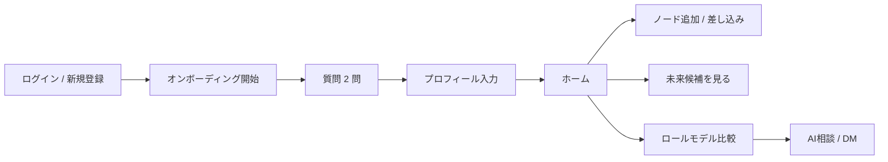
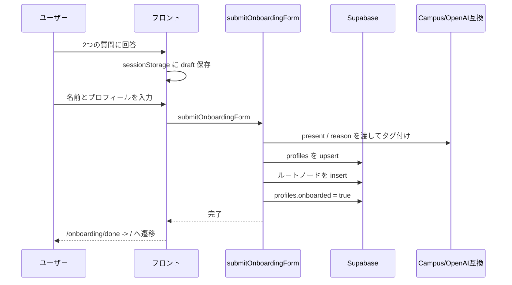
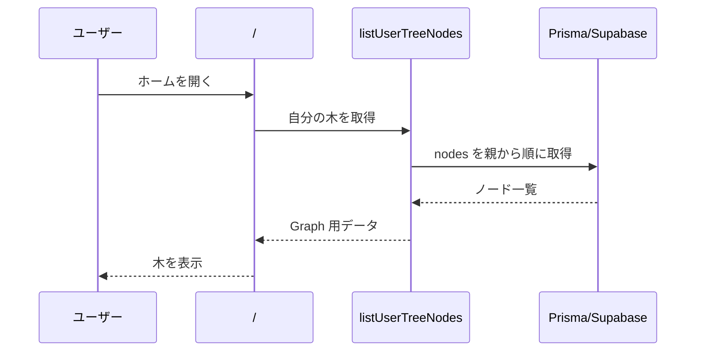
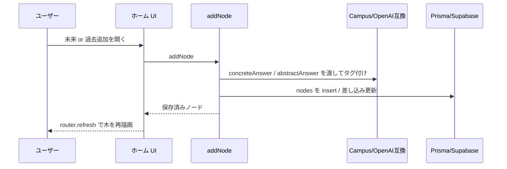
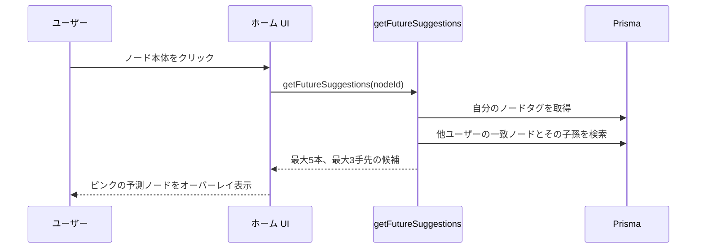
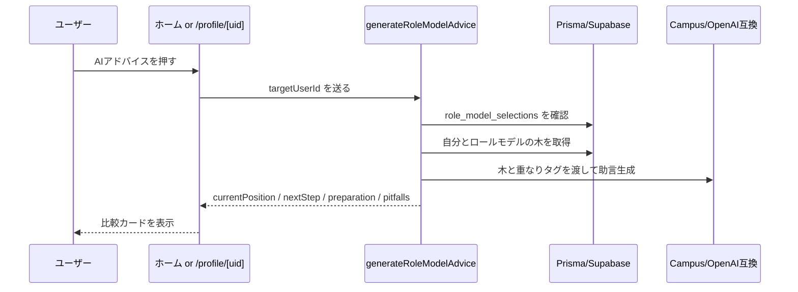
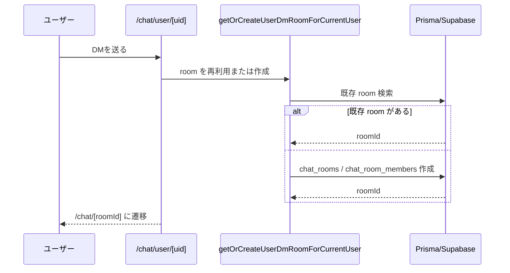
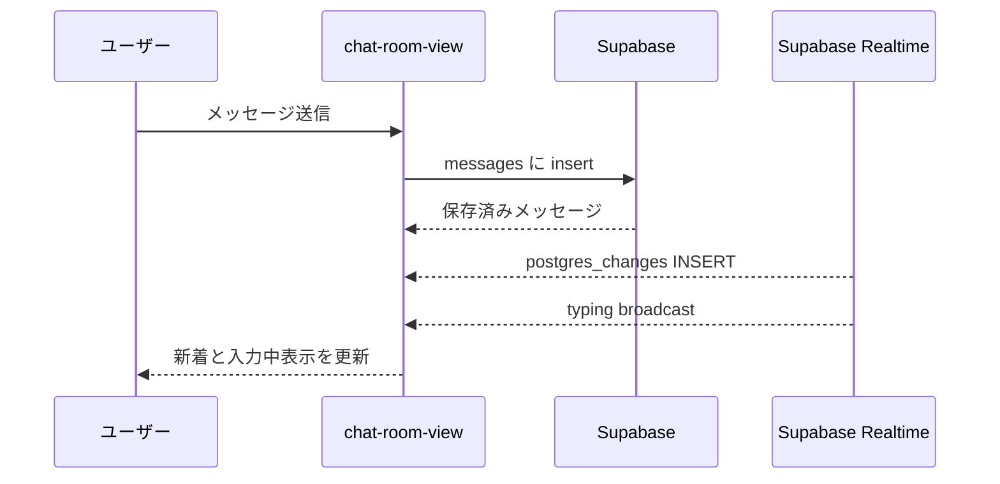
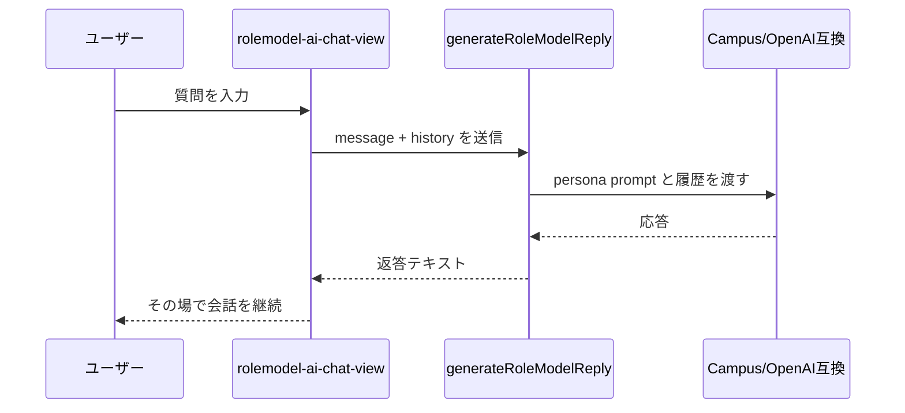

# 処理フロー設計：Decision Path

---

## 0. 前提

| 項目 | 内容 |
| --- | --- |
| 認証 | Supabase Auth |
| UI 基盤 | Next.js App Router |
| 書き込み | Server Actions 中心 |
| リアルタイム | Supabase Realtime |
| AI 用途 | タグ付け、ロールモデル比較助言、擬似人格応答 |

---

## 1. 全体フロー

---

## 2. オンボーディング

---

## 3. ホームの木

### 3-1. 初期表示

### 3-2. ノード追加

### 3-3. 未来候補

---

## 4. ロールモデル比較

---

## 5. チャット

### 5-1. 人間 DM

### 5-2. room 会話

### 5-3. AI相談

---

## 6. エラー処理

| ケース | 対応 |
| --- | --- |
| 未認証 | `UNAUTHORIZED` を返し、画面側で `/auth/login` へ誘導 |
| 入力不正 | `VALIDATION_ERROR` を表示 |
| 他人のノード操作 | `FORBIDDEN` |
| ノード / プロフィール未存在 | `NODE_NOT_FOUND` / `PROFILE_NOT_FOUND` |
| AI 応答失敗 | 画面上に再試行可能なメッセージを表示 |

---

## 7. 実装メモ

- ホームのロールモデル比較カードはモバイルで compact 表示
- 未来候補の補助パネルは desktop のみ。モバイルでは予測ノードだけ表示
- チャットは WebRTC ではなく Supabase Realtime
